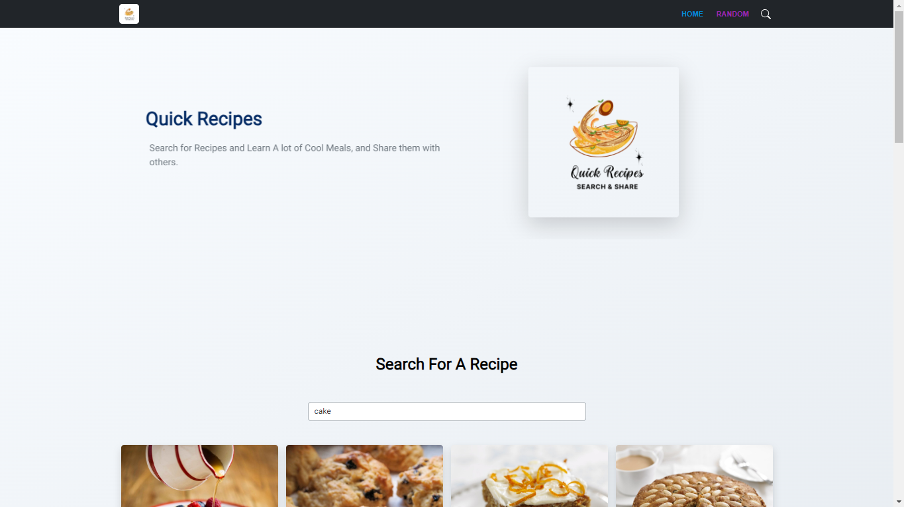
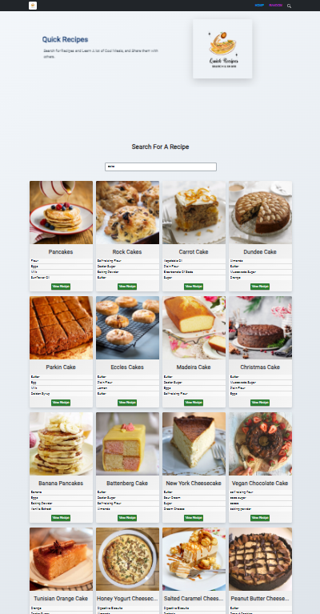
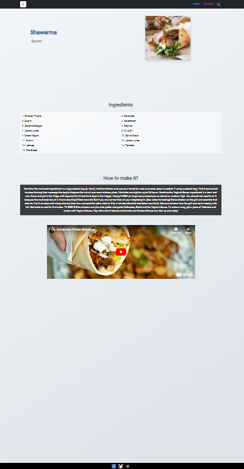

## Quick Recipes

A simple non-profit web application that helps with searching for Recipes/meals for personal needs or sharing them with others, 
It's made using [Themealdb](https://themealdb.com) API.

#### [https://quickrecipes.pages.dev](https://quickrecipes.pages.dev)

### Technologies

- HTML
- CSS
- JavaScript/TypeScript
- ReactJs
- NextJs
- BootStrap
- Material-UI
- Framer-Motion

Check package.json for more informations.

## Screenshots

## Disclaimer
API:
[themealdb.com](https://themealdb.com)

Background:
[eggradients.com](https://www.eggradients.com)
